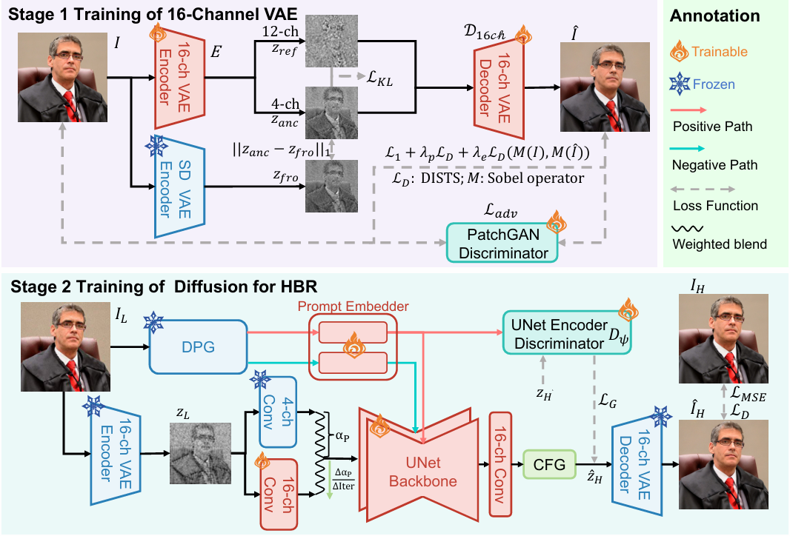
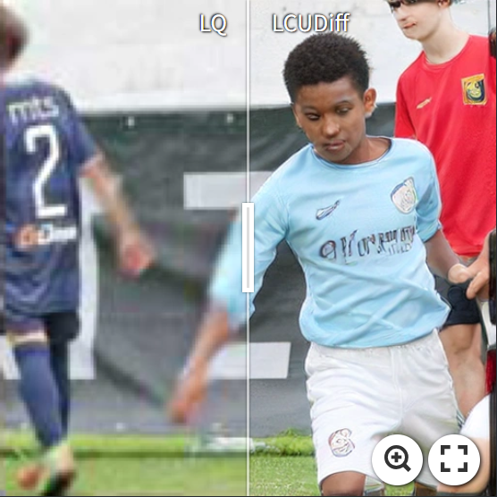
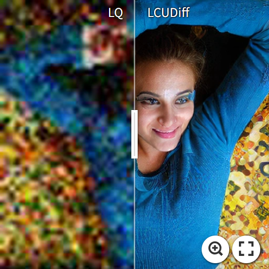
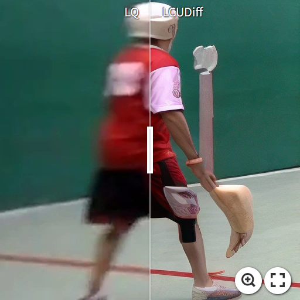
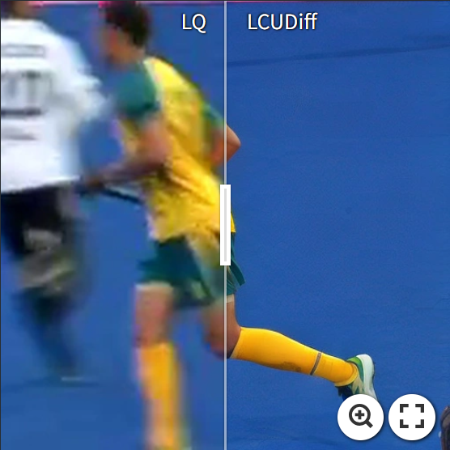
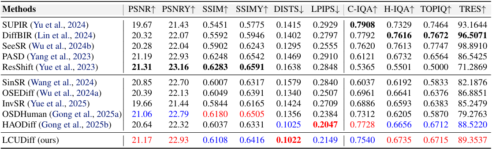
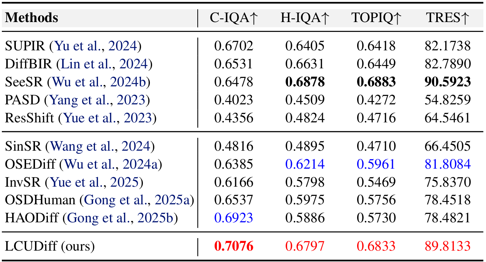
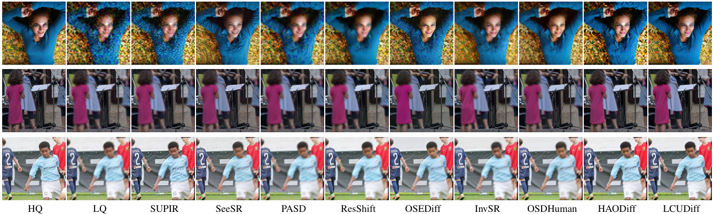
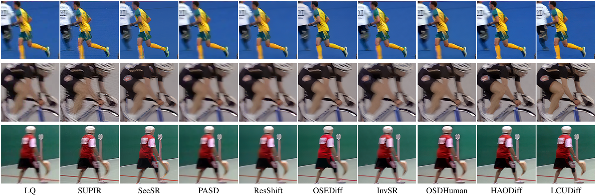

<h1 align="center">
LCUDiff: Latent Capacity Upgrade Diffusion<br>for Faithful Human Body Restoration
</h1>


<p align="center">
<a href="https://github.com/gobunu">Jue Gong</a>, 
<a href="https://github.com/littletoilet">Zihan Zhou</a>, 
<a href="https://github.com/jkwang28">Jingkai Wang</a>, 
Shu Li, Libo Liu,
<a href="http://yulunzhang.com/">Yulun Zhang</a>
</p>

<p align="center">
"We stably expand the latent channels of a pretrained diffusion restorer, enabling efficient one-step human restoration with higher fidelity and fewer artifacts.", 2026
</p>

<p align="center">
  <a href="https://arxiv.org/abs/2602.04406">
    
  </a>
  <a href="https://github.com/gobunu/LCUDiff/releases/download/Paper/supp.pdf">
    
  </a>
  <a href="https://github.com/gobunu/LCUDiff/releases">
    
  </a>
  <a href="https://github.com/gobunu/LCUDiff">
    
  </a>
  <a href="https://github.com/gobunu/LCUDiff">
    
  </a>
</p>


#### 🔥🔥🔥 News

- **2025-02-05:** This repo is released.
---

> **Abstract:** Existing methods for restoring degraded human-centric images often struggle with insufficient fidelity, particularly in human body restoration (HBR). Recent diffusion-based restoration methods commonly adapt pre-trained text-to-image diffusion models, where the variational autoencoder (VAE) can significantly bottleneck restoration fidelity. We propose LCUDiff, a stable one-step framework that upgrades a pre-trained latent diffusion model from the 4-channel latent space to the 16-channel latent space. For VAE fine-tuning, channel splitting distillation (CSD) is used to keep the first four channels aligned with pre-trained priors while allocating the additional channels to effectively encode high-frequency details. We further design prior-preserving adaptation (PPA) to smoothly bridge the mismatch between 4-channel diffusion backbones and the higher-dimensional 16-channel latent. In addition, we propose a decoder router (DeR) for per-sample decoder routing using restoration-quality score annotations, which improves visual quality across diverse conditions. Experiments on synthetic and real-world datasets show competitive results with higher fidelity and fewer artifacts under mild degradations, while preserving one-step efficiency.

<p align="center">
  <br>
   Figure 3: Overall training framework.
</p>


---

<table>
  <tr>
    <td align="center">
      <a href="https://imgsli.com/NDQ3ODA2"></a><br>
      <a href="https://imgsli.com/NDQ3ODA3"></a><br>
      <b>PERSONA-Val</b>
    </td>
    <td align="center">
      <a href="https://imgsli.com/NDQ3ODA0"></a><br>
      <a href="https://imgsli.com/NDQ3ODA1"></a><br>
      <b>MPII-Test</b>
    </td>
  </tr>
</table>


## ⚒️ TODO

* [ ] Release code and pretrained models.

## 🔗 Contents

- [ ] Models
- [ ] Training
- [x] [Results](#results)
- [x] [Citation](#citation)
- [ ] [Acknowledgements](#acknowledgements)


## <a name="results"></a>🔎 Results

The model **LCUDiff** achieved state-of-the-art performance on both the datasets **PERSONA-Val** and **MPII-Test**. Detailed results can be found in the paper.

<details>
<summary>&ensp;Quantitative Comparisons (click to expand) </summary>
<li style="margin-left: 2rem;"> Results in Table 1 on synthetic PERSONA-Val dataset from the main paper. 
<p align="center">

</p>
</li>
<summary>&ensp;Quantitative Comparisons (click to expand) </summary>
<li style="margin-left: 2rem;"> Results in Table 2 on real-world MPII-Test dataset from the main paper. 
<p align="center">

</p>
</li>
</details>

<details>
<summary>&ensp;Visual Comparisons (click to expand) </summary>
<li style="margin-left: 2rem;"> Figure 6: Visual comparison on PERSONA-Val.
<p align="center">

</p>
</li>
<li style="margin-left: 2rem;"> Figure 7: Visual comparison on MPII-Test.
<p align="center">

</p>
</li>
</details>


## <a name="citation"></a>📎 Citation

If you find the code helpful in your research or work, please cite the following paper.

```bibtex
@article{gong2026lcudiff,
    title={{LCUDiff: Latent Capacity Upgrade Diffusion for Faithful Human Body Restoration}},
    author={Gong, Jue and Zhou, Zihan and Wang, Jingkai and Li, Shu and Liu, Libo and Lan, Jianliang and Zhang, Yulun},
    journal={arXiv preprint 2602.04406},
    year={2026}
}
```


## <a name="acknowledgements"></a>💡 Acknowledgements

[TBD]

<!--  -->
